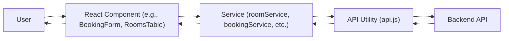

# Application Flowchart (Detailed)

This flowchart shows the detailed data flow in the WPH Hotel UI app, including how React components, services, and the API utility interact:

## Step-by-Step Explanation

1. **User** interacts with the app (navigates, clicks, submits forms).
2. **React Component** (e.g., `BookingForm`, `RoomsTable`) handles the UI and user events. When data is needed or an action is performed, it calls a service function.
3. **Service** (e.g., `roomService`, `bookingService`) contains business logic and prepares data for API calls. It calls the API utility to communicate with the backend.
4. **API Utility (`api.js`)** sends HTTP requests to the backend API, handles authentication, error handling, and parses responses.
5. **Backend API** processes the request, performs database operations, and returns a JSON response.
6. **API Utility** receives the response, checks for errors, and returns the parsed data to the service.
7. **Service** receives the data and may perform additional processing before returning it to the component.
8. **React Component** updates its state and displays the data to the user.
9. **User** sees the updated UI and can continue interacting, repeating the cycle as needed.

This flow ensures a clean separation of concerns and makes the app easy to maintain and extend. 